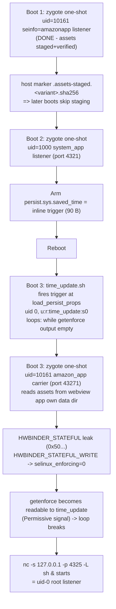

# HANDOFF: Fire HD 10 11th Gen (trona/KFTRWI) Root & Unlock

Status date: 2026-10-05. Written for an agent picking up mid-development.
Read [README.md](../README.md) first for the constitution (info-first,
offline theory-proofing, no live smoke-tests without authorization), then
this file, then [PS7319-ADAPTATION.md](../stage1-root/port/PS7319-ADAPTATION.md).

> **Later status (2026-10-07):** stage 4 makes root survive reboot with no host
> attached, [stage4-persistent/](../stage4-persistent/), measured 13/13
> consecutive reboots. Two claims below are corrected in place: a lost ENODATA
> race is **not** terminal for the boot, and P5 persistence is **done**.
> Sections 0–2 otherwise describe the device as it was on 2026-10-05.
>
> **Later status (2026-10-08):** an exploit-search session produced a self-contained
> research hub, start at [exploits/CONTEXT-ANCHOR.md](../exploits/CONTEXT-ANCHOR.md)
> (STOP LIST of evaluated vectors, open leads, guardrails) and
> [exploits/EXPLOIT-REGISTER.md](../exploits/EXPLOIT-REGISTER.md) (rated findings). It
> closes the pre-gate verifier questions (main PSS decoder: no bypass with a positive
> control; LK certificate parser: asymmetry real but not an authentication bypass;
> temp-unlock verifier: no reachable path skipping the RSA check), corrects the unlock
> model (**an unlocked device does not skip `lk` verification**: it re-verifies with
> the alternate Amazon key), and characterises four to six kernel exploits that do not
> advance unlocking. Stage-1/4 root behaviour is unchanged.

## 0. ROOT ACHIEVED (2026-10-05)

**Stage 1 is complete and live-verified.** The full chain ran end-to-end
three times (`diagnostics/root-run-16.log`, `root-run-17.log`,
`root-run-18.log`):

```
carrier uid=10161 u:r:amazon_app:s0
  -> HWBINDER_STATEFUL        result=0x5000000000000000   (leak)
  -> HWBINDER_STATEFUL_WRITE  result=0x5100000000000000   (NULL write)
  -> getenforce=Permissive
  -> root_service=0 u:r:time_update:s0 on 127.0.0.1:4325
```

Verified root shell:

```
printf 'id\nexit\n' | adb shell 'toybox nc -w 3 127.0.0.1 4325'
-> uid=0(root) gid=1000(system) groups=1000(system),2000(shell) context=u:r:time_update:s0
```

Root is **in-memory per boot** (the NULL write reverts on reboot). The
persistent waiter re-fires every boot while `persist.sys.saved_time` holds
the trigger; the boot time-sync normalizes the property, so re-arming is
needed for a fresh boot (see §6 P2/P5).

> **Superseded 2026-10-07 (stage 4):** re-arming is now automatic and needs no
> host. [stage4-persistent/](../stage4-persistent/) installs a direct-boot actor
> that keeps the trigger armed with a detached watchdog and restores the chain
> itself, **13/13 consecutive reboots, no PC attached**. This file's §6 P5 and
> §1 rows are updated accordingly; the historical text above is kept as written.

**ENODATA remediation (2026-10-05, run-18):** the ~43%-per-boot leak miss
was root-caused (RCU-delayed epitem free outrunning the ~0.4 s race window)
and fixed by rescaling the carrier's shared wait literal 1 ms → 10 ms
(file offset 0x11c8) plus raising the leak/write `nc -w` to 20. Live
validation: **attempt 1/6 HIT**. Full analysis:
[ENODATA-ANALYSIS.md](ENODATA-ANALYSIS.md); patch tool:
[patch-wait.py](../stage1-root/patch-wait.py).

**ENODATA correction (2026-10-07, stage 4):** the rescale reached only the JNI
carrier, and the standalone `snusnu_hwbinder_root`, which stage 4 actually
executes, was left unpatched; it needed a different tool
([patch-wait-inline.py](../stage1-root/patch-wait-inline.py), 9 inline
timespec sites, no `.rodata` literal to rewrite). More importantly, the belief
that a miss was terminal for the boot is **false**: measured in-boot, the
retry after a failed attempt succeeded. That is what makes the persistent
chain reliable. See [ENODATA-ANALYSIS.md §11–§12](ENODATA-ANALYSIS.md).

**Next work is Stage 2 residuals (offline RE) or P5**: see §6. P5 is no
longer open: stage 4 completed it.

**Cross-version carrier registry (2026-10-06, commit 8204d96):** the root
chain now spans PS7319 → PS7331 via per-version carrier variants selected at
runtime by `ro.build.id` (registry:
[stage1-root/carriers/carriers.tsv](../stage1-root/carriers/carriers.tsv);
builder: [make-carrier.py](../stage1-root/make-carrier.py); resolver:
[version_env.sh](../stage1-root/port/scripts/version_env.sh)). PS7321 and
PS7326 share an address (`0xffffff8009969668`); PS7331 is
`0xffffff8009971668`. Unknown firmware fails closed. The webview uid is
resolved at runtime (`pm list packages -U`), no longer hardcoded 10161.
Only PS7319 is live-proven; PS7321/PS7326/PS7331 carriers are built but
their full flows are untested live.

## 1. Where the work stands

| Item | State |
|---|---|
| Stage 0 diagnostics | ✅ done, all PASS ([stage0/](../stage0/)) |
| OTA analysis (PS7319/7326/7331) | ✅ done; symbols validated 3/3 vs ground truths |
| `selinux_enforcing` VA for PS7319 | ✅ `0xffffff8009965628` (1726 OTA; confirmed against the running 1735 boot dump) |
| Carrier binaries patched for PS7319 | ✅ both carriers, capstone-verified |
| Live binary-policy parser | ✅ [tools/policydb-parse.py](../tools/policydb-parse.py); byte-exact vs device policy |
| Asset staging to device | ✅ all 6 assets on-device, SHA-256 verified via listener |
| agent.jar path patch | ✅ [tools/patch-agent-jar.py](../tools/patch-agent-jar.py); same-length dex patch |
| Waiter arming (inline trigger) | ✅ armed; property stores verbatim (88 B) |
| Waiter fires at boot | ✅ `init.svc.time_update=running` = loop alive, blocked on getenforce |
| Carrier spawn (uid 10161) | ✅ live: `uid=10161 context=u:r:amazon_app:s0` |
| hwbinder leak/write → Permissive | ✅ live: `0x50...` → `0x51...` → Permissive |
| uid-0 listener on :4325 | ✅ live: `uid=0(root) u:r:time_update:s0` |
| ENODATA root cause + remediation | ✅ RCU race; 10 ms rescale on **both** carriers (JNI `.rodata` + standalone inline); **miss is retryable in-boot**: see [ENODATA-ANALYSIS.md](ENODATA-ANALYSIS.md) §11–§12 |
| Persistent root, no host | ✅ **done (stage 4)**: direct-boot actor + re-arm watchdog + in-boot retry; **13/13 consecutive reboots** unattended ([stage4-persistent/](../stage4-persistent/)) |
| Cross-version carrier registry | ✅ PS7319/PS7321/PS7326/PS7331 variants built + registered; runtime selection; unknown firmware fails closed (commit 8204d96) |
| Stage 2 (bootloader unlock) | ✅ **research complete incl. residuals + external survey + mtkclient/Reddit-guide assessment** (P4, 2026-10-07/08); [stage2-unlock/README.md](../stage2-unlock/README.md); no forgeable path; Amazon-signed unlock_code required; sunstone techniques proven non-transferable; mtkclient/seccfg path inapplicable (no seccfg partition, BROM unreachable, usbdl stripped) |

**Immediate next action:** Stage 2 research (P4). Root is available on
demand via `root_poc.sh root`, and permanently via
[stage4-persistent/](../stage4-persistent/) (no host needed). Use it for
read-only partition dumps and offline analysis. The device was left
Permissive with root live at handoff.

## 2. Device & environment

- **Device**: KFTRWI/trona, Fire OS 7.3.1.9 (PS7319/1735, incremental
  0020367984516), kernel 4.4.146+ (built 2021-05-29), MT8183, Android 9/API 28.
- **adb**: `C:\Users\<user>\adb\adb.exe`; serial `<SERIAL>`.
- **Host**: Windows. Run all shell scripts via
  `"C:\Program Files\Git\bin\bash.exe" -lc "export ADB=${ADB:-$HOME/adb/adb.exe}; cd /c/Users/<user>/firehd11g_unlock/stage1-root/port && ./scripts/<script>"`.
- **Repo**: private GitHub `wjdob/firehd11g-unlock`, master, commits through
  the cross-version carrier registry (8204d96; see `git log`).
- **OTAs on disk**: [OTAs/](../OTAs/), PS7319 (1726), PS7321 (2324),
  PS7326 (3178), PS7331 (4463). Extracted artifacts in [ota-extract/](../ota-extract/)
  and `ota-extract/ps7331-full/` (system+vendor new.dat decompressed).
- **Kernel source**: `refs/kernel-7.3.1.9/src/kernel/mediatek/mt8183/4.4/...`
  ; the *authoritative* reference for policydb format, binder, Mali.
- **Upstream exploit**: `refs/SnuSnuRoot/`, root.md is the chain doc;
  verified by its author on PS7331.**4460N** (not 4463).

## 3. The root chain (current design, after all corrections)

Three one-shot boots; the waiter needs no one-shot (fires from a persistent
property):



The inline trigger (the single most important artifact of this session):

```
x[$(until [ "$(getenforce)" ];do sleep 1;done;toybox nc -s 127.0.0.1 -p 4325 -L sh&)]000
```

Why inline: `time_update` can read **nothing** we can write (see §4), so
the payload must ride inside the property itself. `time_update.sh` does
`store_time=${store_time%???}` (strips `000`) then `if (("$store_time" > ...))`
, shell arithmetic re-expands `$(...)`, executing the payload as uid 0.
`getenforce` is *denied* to `time_update` while enforcing (empty output) and
readable at Permissive; the loop's break condition **is** the Permissive
signal. TCP sockets are denied to `time_update` while enforcing, allowed
once Permissive, so `nc` can only bind after the carrier's NULL-write.
88 bytes fits `PROP_VALUE_MAX` (91) on API 28.

**`toybox nc`, not bare `nc`:** this device has no `/system/bin/nc`; only
the toybox applet exists. The earlier trigger used bare `nc` and failed
silently after the loop broke (logcat showed the loop spinning correctly
until `permissive=1`, then nothing). Always use `toybox nc` in device-side
payloads.

## 4. Critical technical discoveries (do not re-derive)

### 4.1 The shipped CILs are NOT the live policy

The live policy is `/vendor/etc/selinux/precompiled_sepolicy` (its
`plat_and_mapping` sha256 matches, so it *is* what the kernel loaded).
The binary differs from the shipped CILs in exploit-relevant ways:

- `amazon_app` is **not** in `appdomain` in the binary (the CIL says it is).
  Its asset access is a direct `allow amazon_app app_data_file` (full rw).
- `time_update`'s complete readable set: `shell_exec`, `toolbox_exec`,
  `time_update_exec`, `time_update_tmpfs`, `sysfs_devinfo`, own-domain
  files. **No read** on `cache_file`, `assetstorage_data_file`,
  `system_data_file`, `shell_data_file`. This killed the upstream
  `/data/securedStorageLocation/w/b` bootstrap *and* the earlier `/cache`
  redesign.
- `time_update` has **no `tcp_socket` permissions** (unix sockets only).
- `system_app` cannot write `assetstorage_data_file` (dir or file), 
  matches the empirical Permission denied. Domains that can:
  `platform_app`, `priv_app`, `mediaserver`, `init`.
- `amazon_app` on `assetstorage_data_file:file` has **execute only**, 
  even if assets were staged there, the carrier couldn't read them.

Query tool (attribute-aware, implements the device kernel's own reader):

```
python tools/policydb-parse.py <policy.bin> --query time_update file cache_file
python tools/policydb-parse.py <policy.bin> --src time_update
```

### 4.2 Amazon full OTAs have zeroed ext4 metadata

`system.new.dat`/`vendor.new.dat` are real ext4 images but the inode
tables land in `zero` transfer ranges, directory traversal is impossible.
Both PS7319 and PS7331 behave this way. To extract a file, scan for a
content signature instead (e.g. policydb magic `8cff7cf9` + `"SE Linux"`;
the PS7331 policy was recovered from `vendor.new.dat` at `0xadb000` this
way). `tools/ota-system-read.py` works only for the rare blocks present;
don't rely on it for new extractions.

### 4.3 `time_update.sh` (the injection target), verbatim from the OTA

```sh
store_time=`getprop persist.sys.saved_time`
store_time=${store_time%???}  #convert milliseconds to seconds
system_time="`date +%s`"
if (("$store_time" > "$system_time"))
then
    date -u @$store_time
    print "Successfully set time on boot"
else
    print "Did not set time on boot"
fi
```

Service: `/system/bin/time_update.sh`, `user root`, `group system shell`,
oneshot, started by `load_persist_props_action`. The `((...))` arithmetic
is the injection point.

### 4.4 Early-boot zygote observer race (empirical, repeated)

A `settings put global hidden_api_blacklist_exemptions` fired at +9s and
+45s after `boot_completed` was **silently lost**: SettingsProvider logged
the notification, zygote never observed it, no child, no failure log, no
listener. The same put at ~+3min was observed and worked. Consequences:

- `check_device` settles **120s** (`SNUSNU_BOOT_SETTLE` override).
- Waiter arming and carrier start **retry up to 5×** with 30s spacing, 
  a lost put does **not** consume the boot's one-shot, so retries are safe.

### 4.5 Boot time-sync normalizes `persist.sys.saved_time`

~60s into a boot, the framework's time sync overwrites the property with a
timestamp, *even while time_update is blocked inside the trigger's
getenforce loop*. The trigger has already fired by then, so this is
harmless to the chain, but **property state alone is not a waiter-state
signal**. Use `init.svc.time_update == running` = "fired-and-waiting".
Phase B's precheck and root_poc's gate both accept this state now.

### 4.6 DAC beats MAC: the carrier uid had to change

SELinux said `amazon_app` has full rw on `app_data_file`, but the staged
assets live under `/data/user/0/com.amazon.webview.chromium/` whose
directories are **0700 (app-only DAC)**. A uid-10100 carrier cannot
traverse them even though the files themselves are 0555. Fix: the carrier
now spawns as **uid 10161** (the webview app's own uid, same as the staging
listener) with `seinfo=amazonapp` → same `amazon_app` domain, full
traversal. `carrier_abi.sh` validation updated to expect uid 10161.
**Live-verified** (root-run-16): `uid=10161 context=u:r:amazon_app:s0`.

### 4.6b agent.jar hardcoded the upstream asset path

The upstream `agent.jar` dex embeds `ASSET_DIR =
/data/securedStorageLocation/codex.amazon.jni.v51` (49 chars) and the JNI
prefix (69 chars). On PS7319 the assets live in the webview app's data dir,
so the jar must be patched. [tools/patch-agent-jar.py](../tools/patch-agent-jar.py)
does a **same-length** dex string replacement
(`/data/user/0/com.amazon.webview.chromium/files/sn`, also 49 chars) so the
dex layout stays byte-aligned, then recomputes the Adler-32 checksum
(offset 8) and SHA-1 signature (offset 12) so ART accepts the file. The
patched jar is installed at
`stage1-root/port/prebuilt/device/arm64-v8a/agent.jar`
(sha256 `0d49be2d...`). The asset dir name `sn` is deliberately short to
match the old path length, do not rename it without re-patching the jar.

### 4.7 Git Bash (MSYS) path mangling: two stacked issues

Git Bash rewrites leading-slash args for native binaries:
`adb push x /data/local/tmp/y` becomes `...C:/Program Files/Git/data/local/tmp/y`.
Fix: `MSYS_NO_PATHCONV=1` exported in `tools/adb-portable.sh` **and** at the
top of `reroot_after_boot.sh`. Caveat: with conversion disabled, *absolute
MSYS-style local paths* (`/c/Users/...`) no longer convert, `root_poc.sh`
passes `$payload_default` (an absolute `/c/...` path) down to Phase B, so
`reroot_after_boot.sh` normalizes `/c/...` → `C:/...` before pushing.
Relative local paths are unaffected either way.

### 4.8 Verification must use the channel that has access

`stage_initial_root_assets.sh` originally verified hashes via plain
`adb shell` (shell domain), which cannot read `app_data_file`, so every
asset reported "absent" even though transfers verified. All verification
of app-data assets now goes through the uid-10161 listener (port 4322).
Related: `reroot_after_boot.sh`'s `remote_elf_class` still reads the JNI
via plain adb shell, **it will report UNKNOWN for the same reason**; fix
it to query through the carrier's own `ID` protocol (the carrier already
reports `elf=`/`jni=` fields) before relying on it.

## 5. Live-run chronology (what each failure taught)

| Run | Outcome | Lesson |
|---|---|---|
| root-run-2 | staging "failed"; assets actually landed | verify must go through the listener (§4.8) |
| root-run-3 | manual arming at +3min **succeeded** | the working point for the observer race |
| root-run-4 | arming at +9s lost | settle needed (§4.4) |
| root-run-5 | re-staging burned the one-shot | host marker added; skip staging when verified |
| root-run-6 | arming at +45s lost ×2 | settle 120s + retries |
| root-run-7 | armed ✓, but after reboot property numeric | time-sync normalization (§4.5) |
| root-run-8/9 | "payload push failed" | MSYS path mangling (§4.7) |
| root-run-10 | push still failed in-script | unresolved; see §6 P1 |
| root-run-11 | push OK; carrier 10100 never came up ×5 | DAC traversal (§4.6) |
| root-run-12 | full flow: armed ✓, waiter fired ✓, push failed ×3 | MSYS local-path issue (§4.7, P1 resolved) |
| root-run-13 | carrier uid 10161 spawned ✓, but reported the OLD asset path | agent.jar hardcoded path (§4.6b) |
| root-run-14 | **leak 0x50… ✓, write 0x51… ✓, Permissive ✓**: no root listener | bare `nc` not in PATH; must use `toybox nc` |
| root-run-15 | leak hit transient ENODATA (0x5000003d…) | auto-retry path; retry gate had the ARMED-only bug |
| root-run-16 | **ROOT: `uid=0(root) u:r:time_update:s0` on 4325** | chain complete |
| root-run-17 | P2 reproducibility: att1–3 ENODATA, att4 HIT | full cold-boot re-run works; miss rate data |
| root-run-18 | **patched carrier: attempt 1/6 HIT** | 10 ms wait patch covers the RCU tail ([ENODATA-ANALYSIS.md](ENODATA-ANALYSIS.md)) |

## 6. Open bugs / next actions (in order)

**P1(payload push fails only inside the full script) RESOLVED.**
Root cause (two stacked MSYS issues): (a) Git Bash rewrote adb's
device-side paths (`/data/...` → `C:/Program Files/Git/data/...`), fixed
by `MSYS_NO_PATHCONV=1` in `tools/adb-portable.sh` and at the top of
`reroot_after_boot.sh`; (b) with conversion disabled, the *absolute MSYS
local path* that `root_poc.sh` passes down (`/c/Users/...` from
`$payload_default`) is no longer translated for native `adb.exe`, fixed
by normalizing `/c/...` → `C:/...` before the push in
`reroot_after_boot.sh`. Both fixes verified live (push succeeds with the
exact script-style invocation). Note the payload file is **vestigial**
with the inline trigger (the nc listener on 4325 *is* the root service);
if any push trouble remains, making the payload argument optional and
skipping the push entirely is a safe simplification.

**P2, re-arming for a fresh boot (operational).** Root is in-memory per
boot. To re-root after a reboot: `root_poc.sh root` (it re-arms the waiter
if the property is numeric, then runs Phase B). The boot time-sync
normalizes `persist.sys.saved_time` ~60s in, so the waiter-state gate
accepts `init.svc.time_update=running` as "fired-and-waiting", do not
"fix" that gate back to ARMED-only.

**P3, runtime `selinux_enforcing` resolution.** Carriers embed the 1726
value; device runs 1735. The write **worked live** (Permissive confirmed),
so the compiled-in address is correct for this build. Runtime resolution
remains a robustness improvement, not a blocker.

**P3.5(ENODATA remediation) RESOLVED, then CORRECTED (stage 4, 2026-10-07).**
The ~43%-per-boot leak miss was root-caused offline (RCU-delayed epitem free vs
the ~0.4 s race window; [ENODATA-ANALYSIS.md](ENODATA-ANALYSIS.md)) and fixed by
rescaling the carrier's shared wait literal 1 ms → 10 ms (file offset 0x11c8,
[patch-wait.py](../stage1-root/patch-wait.py)) plus raising the leak/write
`nc -w` 6 → 20 in `reroot_after_boot.sh`. Live validation run-18:
**attempt 1/6 HIT**. Two things were learned later and matter more:

- The rescale missed the **standalone** carrier, which has no shared literal and
  needed [patch-wait-inline.py](../stage1-root/patch-wait-inline.py). Stage 4
  executes that carrier, so it was running unpatched until then.
- **A miss is not terminal for the boot.** Measured: a boot whose first attempt
  returned ENODATA succeeded on the next attempt in the same boot. The 6-attempt
  reboot loop is therefore one way to recover, not the only one, stage 4 retries
  in-boot instead, which is why it reaches 13/13.

**P4(Stage 2 (bootloader unlock)) RESEARCH COMPLETE (2026-10-06),
residuals + external survey COMPLETE (2026-10-07).**
Static RE of the LK (mmcblk0p5), preloader (mmcblk0boot0), and IDME
(mmcblk0boot1) is done; the full mechanism is documented in
[stage2-unlock/README.md](../stage2-unlock/README.md). Key results:
- The XDA "IDME `flash:unlock` flag" does not exist. The real unlock is an
  **Amazon-signed `unlock_code`** (RSA-2048-PSS over a per-device composed
  string from `unlock_version`), stored in IDME and verified by BOTH the
  preloader (AMZN_UNLOCK @ 0x33e0) and LK (`amzn_verify_unlock` @ 0x1ce0).
- The preloader PSS-verifies the LK image itself (sig = last 0x100 bytes,
  `_LK_VER:` tag); **an unlocked device re-verifies with the alternate image key
  (0x37a98) and still rejects a modified image**, which explains why the XDA LK
  patch bricked (reject → no BROM exit) and narrows what a real unlock would
  enable: it changes which Amazon key is accepted, not whether one is required.
- Verified 2026-10-06: the signed range is exactly `LK[0x200 : size-0x100)`
  (the 0x200 container header is outside the signature) and the verifying key is
  the **prod image key at preloader 0x37b98**, not the unlock key at 0x37c98.
  The header's size word drives both the pre-auth flash→RAM copy and the verify
  length, and the copy happens *before* the check; a pre-auth write primitive
  (needs LK write access + DRAM map; see stage2-unlock/README.md).
- Live-device session 2026-10-06 (read-only, root listener): DRAM map collected
  into [../diagnostics/dram-map-1735.txt](../diagnostics/dram-map-1735.txt).
  Two results shape the primitive: the flash read is bounded by the **card**
  (`sd_blknr`), not by the 1 MiB `lk` partition, so the copy *can* run far past
  the 9 MB LK window; but the preloader's own working set is `g_dram_buf` at
  **0x44800000**, i.e. *below* the window, and nothing is reserved between the
  window end (0x56900000) and the framebuffer (0x624e0000). The only identified
  preloader structure above the window is the MTK context save/restore slot at
  **0x5f100c00** (SP +0x24, LR +0x28, CPSR +0x2c), role unresolved, and only
  `recovery`/`cache` content can be steered that high (neither writable while
  locked). No confirmed control-flow target ⇒ still no safe unlock.
- Correction: the earlier note that the preloader is linked at 0x483df000 was
  based on dwords that actually span instruction halfwords; the base is not
  established and that claim is withdrawn.
- Branch/tracer analysis 2026-10-06 (tool: `stage2-unlock/pl-cfg.py`): the
  0x5F100C00 context slot **is** on the boot path; the PICACHU DVFS module
  (entry 0x29a44, single caller 0x21590 → boot flow 0x19fcc, workspace base
  0x5F000000) saves a context there via SAVE 0x296f0 (sole caller 0x298b4) and
  hands the RESTORE 0x291a4 to an external component (0x299e0 → `blx` handler
  with r0 = 0x291a5). But it runs strictly **after** the LK load/verify, its
  workspace is written before it is read, and the preloader's own image/BSS
  lives at ~0x00100000-0x00240000 (data pointers at file 0x3c1a0-0x3c2cc), all
  below the LK window. Enlarging `hdr[4]` also breaks the `_LK_VER:`/signature
  check, so the copy cannot exceed the window while staying verifiable.
  ⇒ the pre-auth copy vector is **closed**; the outcome is the known brick.
- Extended bypass analysis 2026-10-06 (widening pass). Three results:
  (1) **load/verify matrix complete and fully paired**: every preloader-loaded
  image is verified by one of four wrappers (0x2f58 lk, 0x2f8c sspm, 0x2fc0
  cam_vpu1/2/3, 0x2ff8 spm) or by 0x26034 (atf/atf_dram/tee), all through the
  same orchestrator 0x2c5c and the same two image keys. No unverified load
  exists; the `mtee` name in the 0x2f569 table maps to no load site.
  (2) **LK authenticates its images with certificates, not raw keys**, 
  `amzn_image_verify` 0x1238 SHA-256s the image (0x2c408) then calls the cert
  verifier 0x14b0; trust anchors are embedded constants selected by 0x1218
  (prod 0x4746c len 0x42f, eng 0x479c4 len 0x431, matching lk-prod-ca-cert.der
  and lk-eng-ca-cert.der). Selection uses `amzn_is_production_device` 0xe420,
  which reads the byte at `**[0x938a0]+0x59a7` (= the exported
  `androidboot.prod`). Called from 0x130ec and 0x13528 in an image loop.
  (3) **New attack surface: LK's hand-rolled certificate parser** (0x14b0,
  ~1.7 KB), strings `tbsCertificate is empty` / `Failed to get tbsCertificate
  length` / `Failed to malloc tbsCertificate` / `Failed to encode
  tbsCertificate` / `Cannot find signature in user certificate` /
  `Failed to extract root CA public key`; signature lookup requires tag==4; the
  result must be exactly 1 (0x1782-0x1786). This is the CVE-2023-20696 class
  (ASN.1 parsing inconsistency) and is the residual risk after this pass.
  Vectors catalogued: V1 cert-parser bug → custom boot image = persistent root
  (blocked: would need writing `boot` with an unproven bug; destructive);
  V2 flip the prod flag → engineering mode (blocked: needs provenance we could
  not pin, plus an eng-signed image that is unobtainable; device reports prod=1);
  V3 lk2 slot (dead: verified with name `lk` and the same key, plus a GPT write);
  V4 -sig_len underflow (no bypass); V5 dkb/keys (dkb all-zero, keys is ext4 DRM).
- Stage 3 opened 2026-10-06 (`stage3-recovery/`), device-recovery research,
  because only one live unit exists and a failed verification is fatal:
  * **Found: the BROM-download request register is software-managed, not fused
    off.** Routine 0x211e8 unlocks writes with magic 0xAD98 -> 0x1001A100 + bit0
    of 0x1001A108, then writes **0x444CFFFC|bit0 to 0x1001A080**
    (USBDL_FLAG/BOOT_MISC0). Call sites: the two normal handoff routines
    (0x197b8, 0x19818) pass flag=0 -> they **clear** the request before jumping
    to ATF/LK; 0x19e8a is the RPMB-provision reboot path; 0x256ea is a stub.
  * **Found: the preloader fatal-error handler is a loop, not a hang.**
    0x21670 prints "PL fatal error...", brings up UART (0x11002000, 115200),
    calls the "Force brom download recovery" check 0x25998, then prints
    "PL delay for Long Press Reboot" and polls key 8 for up to 3x5 s before
    spinning. So a bricked unit (S2) still runs this handler.
  * **Found: key detection is a plain GPIO read**: `ldrh [0x10010004 +
    (k>>4)*4]`, bit (k&0xF), active-low (0x18eac). Key 1 = BROM-recovery key,
    key 8 = long-press reboot.
  * **Negative but important: 0x25998 does NOT call 0x211e8.** Its full call set
    is 0x18eac/0x25414/0x23610/0x25f74/0x25928/0x25dcc/0x20010/0x17860. So
    "Force brom download recovery" only re-reads the preloader image and reports
    success; whether it leads to download mode is **unproven**.
  * **LIVE RESULT: register reads from Android are impossible**, 
    `CONFIG_DEVMEM` is **not set**, `/dev/mem` does not exist, and toybox has no
    `devmem`. So 0x1001A080 cannot be observed (or compared pre/post boot) from
    userspace on this build, even as root. UART is the remaining observational
    route.
  * Other recovery-adjacent leads found: RTC-triggered "Enter first boot/recovery"
    (0x252c0), `boot_para` carrying `T_DRAM_FATAL_ERR_FLAG`, META/ADVEMETA modes,
    `METAFORB` forbidden-boot table, UART META.
  * Explicit: **no recovery path was validated; no writes performed.** The one
    guaranteed route is hardware (eMMC ISP), and every root-writable partition
    lever is useless in a bricked state because Android is what makes it
    writable.
  * LK certificate-parser audit 2026-10-06 (offline, follow-up to the V1 lead):
    **Structure**: `amzn_image_verify` 0x1238 (SHA-256 via 0x2c408, then
    `cert_verify(1,digest)` = prod root else `cert_verify(0,digest)` = eng root,
    gated by `amzn_is_production_device` 0xe420) → `cert_verify` 0x14b0 → DER
    decoder 0xa06c (nodes 0x20 bytes: type/ptr/len/tag/next) → length pass 0xaa50
    → encoder 0xa69c. The tbsCertificate path (0x1652 length → 0x1666 malloc →
    0x168e encode) is a genuine two-pass length-vs-content structure.
    **DER length decoder bounds are CORRECT**: all four classic guards present, 
    `nlen <= 4` (0xa140), `nlen <= inlen-2` (0xa146), and
    `total = payload + hdrlen <= inlen` checked in BOTH short and long form
    (0xa0cc). The naive declared-length-exceeds-buffer overflow is **not
    available**. The long-form size selector uses 0xfffe as the 2-byte threshold,
    so a length of exactly 0xffff over-counts by one byte (safe direction).
    **Dual-parse present but NOT proven unequal**: the type-dispatch bound is
    identical in length (0xaab0) and encode (0xa70c), both `type-1 <= 0x12`, so
    a type-domain mismatch is excluded, but per-type `length_added` vs
    `bytes_written` equality across all 19 handler pairs is **unchecked**.
    **No bug found, no bug excluded.**
  * **Failure-mode finding (the actionable one)**: LK's boot-image verification
    failure is a display-and-return path, NOT a panic, 0x40504 prints "Please
    download %s image with correct signature" + "Your device will reboot in 5
    seconds.", delays 5000 ms (0x44abc), returns **-1**; wrapper 0x405c0 is a
    state machine on the global at 0x935b4; verify wrappers 0x12420/0x12450 call
    0x40444 and route failures there. So a **bad `boot` image leaves LK running**
    with its full fastboot, versus a bad `lk` which leaves nothing (the confirmed
    S2 class). LK-side recovery affordances found: `oem reboot-recovery`
    (0x79845), `reboot-bootloader` (0x7979e), key-combo fastboot entry (0x29a5c),
    `IDME initialize failed, force to fastboot mode` (0x58909 / code 0x116a4),
    `=> FASTBOOT mode...` (0x587d9 / code 0x1140e), and a boot-mode selector with
    a `recovery` image load path (0x3031e/0x30352, app/mt_boot/mt_boot.c).
  * **UNRESOLVED, do not overclaim**: the locked-device fastboot gate. One
    exists (0x313ee → 0xdd00 → message 0x79510 "the command you input is
    restricted on locked hw") with explicit refusals (`flash preloader is not
    permitted.` 0x7a98c; `Only usr_flags can be set for a locked device`
    0x4b947), but resolving 0xdd00's allow/deny lists produced **incoherent
    results** (static tables at 0x8386c/0x83880 resolved to libtomcrypt
    source-path strings). Either it is a generic list-membership helper with
    runtime-populated lists (0x2c868/0x2c87c), or the table base is wrong.
    Until closed, the honest summary is: **a bad `boot` image leaves the device
    alive and interactive, not necessarily restorable.**
  * LibTomCrypt dependency audit 2026-10-06 (offline): prompted by the
    ltc_ecc_mul2add.c string, established that **LK's certificate path is stock
    LibTomCrypt, not custom code**: 60 ltc modules are linked (full DER
    decode+encode, pkcs1 mgf1/pss_decode, rsa exptmod/import/verify_hash/
    make_key, a 5-module ECC fragment, sha256). Function identification:
    **0xa06c = der_decode_sequence_flexi**, **0xaa50 = der_length_sequence**,
    **0xa69c = der_encode_sequence_ex** (identified by their NULL-check error
    strings and their own source-path strings). Presence of
    der_decode/encode_raw_bit_string + the RAW_BIT_STRING node type places it at
    **LibTomCrypt >= 1.18**.
    **19-pair comparison result: no length/encode mismatch found.** Both dispatch
    tables use the identical type bound (`type-1 <= 0x12`, at 0xaab0 and 0xa70c),
    so a type-domain mismatch is excluded; the length-of-length boundaries agree
    (outer header 0xa7d2 vs final header 0xab90 both 0x7f/0xff/0x10000/0x1000000);
    and the asymmetries found are all SAFE-direction:
    (a) CUSTOM_TYPE's length handler (0xab6c) uses 0xFFFE rather than 0xFFFF as
    its 2-byte threshold -> over-states by 1 byte for content == 0xffff;
    (b) der_encode_sequence_ex returns CRYPT_INVALID_ARG for LTC_ASN1_CHOICE
    (0x0c) and LTC_ASN1_TELETEX_STRING (0x11) while der_length_sequence computes a
    length for TELETEX -> a re-encoded sequence containing TELETEX errors out
    rather than overflowing. **Conclusion: vector V1 (DER logic bug enabling a
    custom boot image) currently has NO identified bug and is not worth a
    destructive test.** Also corrects the earlier attribution: the "hand-rolled
    certificate parser" was mis-identified; it is upstream library code with
    Amazon build paths baked in. (This is the second time a "custom parser" turned
    out to be stock library code, worth remembering.)
  * **LK has an infinite hang path**: 0x0b90 is `b 0xb90` (self-loop), reached
    from 0xb6e when an mblock/DT node would overflow a 0x6000-byte buffer, after
    printing "Will enter into busy wait loop with no recovery!!" (0x4685a). A
    genuine no-recovery state inside LK, relevant to stage3's brick taxonomy.
  * Live diagnostics 2026-10-06 (fastboot experiment): **`adb reboot bootloader`
    reliably enters LK fastboot**, enumerating as **USB VID_1949:PID_05E0** with
    interface class **0xFF/SubClass 0x42/Proto 0x03**: the standard fastboot
    interface signature, i.e. genuine fastboot under Amazon's VID. The device
    stayed in fastboot >4 min without self-resetting and the instance ID carries
    the serial (<SERIAL>). **Host blocker:** Windows reports ProblemCode
    28 (no driver bound), so `fastboot devices` sees nothing; Google's fastboot
    matches on interface class, so binding a WinUSB/libusb driver
    (UsbDk or libusb-win32, both already in mediatekTools/) should make it work.
    *(SUPERSEDED 2026-10-06 later session: solved. UsbDk does not help because
    `fastboot` never opts into its API; neither Microsoft's signed `winusb.inf`
    nor Amazon's kindle driver matches `PID_05E0`. A custom WinUSB INF works, 
    built with `makecat` + `signtool`, no Zadig needed, provided it registers
    Android's interface GUID `{F72FE0D4-…}`. See
    `stage3-recovery/host/winusb-fastboot/`. Also: the gate refuses every write
    and every `oem` command while locked, so fastboot is read-only in practice.)*
    Also observed: the **MTK preloader's own USB** (VID_0E8D:PID_2000, ~2 s
    window) briefly enumerates on every boot, confirming the usbdl interface from
    the USB audit is live per boot. **`adb reboot bootloader` did NOT enter
    BROM/EDL**: it produced fastboot. On the first attempt the device returned to
    Android after a watchdog reset (`persist.sys.boot.reason=watchdog`, uptime
    49 s); tethered root was lost as expected (getenforce=Enforcing, listener
    down) and stage1-root must be re-run for further root work.
  * **OTA usability finding (stage3-relevant)**: the OTA updater script restores
    EVERYTHING including `preloader`, `lk`, `tee1/2`, `boot`, `spmfw`, `sspm_1`,
    `cam_vpu1..3`; a complete boot-chain restore. But (a) it runs in recovery,
    which LK boots, so it is useless for an LK-failure brick; and (b) the
    PS7319/1726 package has a downgrade guard
    `(!less_than_int(1619231913, ro.build.date.utc)) || abort(E3003)` and this
    device reports **1622314026**, so **the 1726 OTA will NOT apply to this
    device.** The newer packages (PS7321/2324, PS7326/3178, PS7331/4463) are the
    usable recovery OTAs, all targeting trona.
  * Read-only device diagnostics also collected 2026-10-06: flash.locked=1,
    verifiedbootstate=green, prod=1, secure_cpu=1, rpmb_state=2,
    mnt_keys_rw_opts=ro; force_ro=1 on both eMMC boot partitions; no unexpected
    root listeners. IDME = 35 fields incl. bootmode=1, postmode=0, bootcount=0,
    unlock_code empty, unlock_version value at 0x2b18 = 5fc171a088b05201, KB
    5120 B 'KBPF', DKB empty, device_type_id, board_id. misc entirely zero;
    kb sparse 'KBPF'; dkb all-zero; keys = ext4 with amzn_dhav2 DRM files.
  prod=1, secure_cpu=1, rpmb_state=2, mnt_keys_rw_opts=ro;
  force_ro=1 on both eMMC boot partitions (root-writable via sysfs → IDME access
  confirmed); no unexpected root listeners. IDME = 35 fields incl. `bootmode=1`,
  `postmode=0`, `bootcount=0`, `unlock_code` empty, `unlock_version` value at
  0x2b18 = 5fc171a088b05201, `KB` 5120 B 'KBPF', `DKB` empty, `device_type_id`,
  `board_id`. `misc` is entirely zero. `kb` sparse 'KBPF', `dkb` all-zero,
  `keys` ext4 with amzn_dhav2 DRM files. **No writes were performed.**
- Preloader USB audit 2026-10-06: complete command-dispatch map. The USB read
  surface found by the vtable-idiom scan is four call sites (1/2/4-byte fixed +
  SEND_DA); **note this inventories one encoding only**: a fifth fixed-length
  read exists in the handshake via a *cached* transport pointer (0x55ca-D2), so
  the scan is not a completeness proof. **One defect**:
  `SEND_DA` (0xD7) reads a host-supplied length to the fixed address 0x40200000
  (0x5754) and only then checks it against DA_RAM_LENGTH 0x120000 (0x5850), the
  CVE-2022-20055/56/58/59 class. Reach is **not** distance-limited (the receive
  loop keeps a 32-bit remaining count and the handler disables its timeout, and
  g_dram_buf is already live at USB entry), but the destination is hard-coded so
  the write is forward-only, the acceptance flag/transport/ring live in SRAM
  *below* the DA base, and the failure path zeroes the whole range before
  panicking. Closure revised to "no useful consumed target identified".
  Numeric handling is sound: READ32/WRITE32 have an alignment guard, a nonzero
  guard, an explicit `count < count*4` check, and a wrap-safe containment test
  (0x25848 requires `end > addr`); the overflow result holds **jointly** via the
  arithmetic + tiny-window argument, not from two independent guards. Also found:
  an unchecked `total − sig_len` at 0x5876 (CVE-2022-20073 candidate, no bypass
  demonstrated). JUMP_DA is auth-flag gated (0x593e-0x5950). PMIC access via
  0xC4/0xC6/0xC7 is bounded to <= 0xFFFF through PWRAP. ⇒ no unlock route from USB.
- vectorResearch2 evaluation 2026-10-06: its **central claim is confirmed on our
  images**. `tee.img` (sha256 c34e2aea…) is three wrapped components, `atf`
  (0x13c00 @ 0), `atf_dram` (0xda00 @ 0x13e00, destination literal 0x54600000 @
  file 0x1974c), `tee` (0x2b6000 @ 0x21a00), and both installed tee partitions
  (p6, p7) match it byte-for-byte. The copy uses the **unsigned outer** `hdr[4]`
  while the verify uses `inner[0x08] + inner[0x18]` computed at 0x2ba92-9c, with
  no equality check; 0x26034 discards the caller's size entirely. All three
  signatures verify (PSS/SHA-256/MGF1/salt 32) against the modulus at preloader
  0x388f0 over the inner extent. Boot order verified: LK load 0x19d2e → LK verify
  0x19d62 → chained loader 0x19dc2 (atf_dram copy at 0x1968e, verify 0x196ce) →
  handoff 0x1a00c, with **no LK re-verification**. Exploiting it would need
  `tee1` (4-byte hdr[4] change), a relocated `tee` container, and a matching
  ~3 MiB `metadata` region (LK's entry maps to flash 0x261C000 = metadata+
  0x1014000), boot-critical writes with an unrecoverable failure mode, and the
  payloads are encrypted (entropy ~8.0) so the ATF-side re-check cannot be
  audited offline. ⇒ real defect, not a practical unlock; not attempted.
- Corrections applied after external review (the reviewer was right on all six):
  (1) the loader's pre-copy guard *does* include the length (it computes
  `dest + size` at 0x201e2) but only protects `g_dram_buf`'s interval;
  (2) the verify size is `hdr[4]` (0x938f0), not `hdr[4] + 0x200`; the `0x200`
  only advances the flash cursor; (3) `tee`'s outer header carries 0x08c00000,
  not the 0xffffffff sentinel, so not every nested header uses the wildcard;
  (4) `g_dram_buf` is ~280 MiB below the LK window, not 2.5–40 MB;
  (5) window-end→framebuffer is ~188 MiB, not ~11.8 MB; (6) the old
  source-to-destination table (including a bogus 0x89c00000 wrap row) was
  recomputed. Also softened: the USB read-site inventory covers one *encoding*
  (a fifth read exists via a cached transport pointer at 0x55ca-D2), and
  "locked ⇒ recovery/cache unwritable" conflated fastboot policy with raw
  block-device access.
- The unlock pubk is embedded in both bootloaders (LK 0x4bab8 == preloader
  0x37c98 modulus); forging is impossible without Amazon's private key.
- `fastboot flash:unlock <blob>` is fail-safe (verify → do nothing on
  failure); IDME writes are possible as root but pointless unsigned.
- **Residuals answered (2026-10-07):** (1) the composed request is
  `'0x' + '%08x'%plat_id13 + '%08x'%plat_id12 + '%08x'%unlock_version_dword`
  (26 chars; LK compose fn 0xe43c, fmt @ 0x4bbde; preloader 0x33e0; ids
  12/13 come from a runtime .bss platform table, not statically
  extractable, but `getvar:unlock_code` returns the composed string
  live). (2) `getvar:unlock_code` **does** return the exact request string
  (handler 0xe5f0 calls the compose fn). (3) `usr_flags` (the only field
  settable on a locked device) has **no boot-security effect**; the
  SELinux/dm-verity bits live in `dev_flags`/`fos_flags` which are
  lock-gated. (4) **No anti-rollback on LK**: the preloader reads the
  2-byte version (0x0106) and only logs it; no minimum-version compare.
- **External survey (amonet-sunstone/kaeru, Fire Max 11 MT8188): none of
  the sunstone entry techniques transfer.** Our preloader *has* the full
  MTK usbdl protocol (handshake 0x17d1c, command loop 0x5658, DA download,
  JUMP_DA0 0x592e) but: DA auth is enforced (secure-chip eFuse bit →
  RSA-2048 vs the hardware SBC key, not in the image), the BROM-style
  memory R/W commands are range-checked to WDT/SEC regs only, and there
  is no `FASTBOOT_PLEASE` misc command (only `boot-recovery`, which **is**
  root-writable and safe, useful for future recovery work). The sunstone
  unsigned-DA trick works on MT8188 because that chip's secure bit is
  clear ("DA validation disabled on non-secure chip"); ours is burned.
**Hard rule unchanged: no writes to boot-critical partitions.**

**mtkclient / Reddit-guide toolchain assessment (2026-10-08): the entire
r/androidroot guide (Fl0w) is inapplicable, three independent blockers.**
(1) The "MediatekBootloaderUnlocker" is just portable mtkclient 1.4
running `xflash seccfg unlock`, and **this device has no `seccfg`
partition** (GPT: kb/dkb/keys/misc/lk/tee1/tee2/metadata/boot_para/nvcfg/
spmfw/sspm_1/cam_vpu1-3/boot/recovery/cache/system/vendor/userdata);
Amazon replaced seccfg with the IDME `unlock_code` system (P4). (2) Every
exploit in the chain (kamakiri, kamakiri2/linecode, mtksecbypass payloads)
is **BROM-stage**, and the BROM is factory-patched unreachable on KFTRWI
(Pardee); the guide's vol+power step lands in Amazon's preloader usbdl,
not the BROM. (3) The preloader usbdl is stripped and hardened
(disassembly-verified): **no `0xE0` SEND_CERT, `0xE2` SEND_AUTH, `0xE3`
SLA, `0xDA` brom_register_access, or `0xD6` JUMP_BL in the command
dispatch**: the auth-upload commands the tools depend on don't exist in
this build; SEND_DA/JUMP_DA are DA-auth-gated vs the Amazon hardware SBC
key; mem R/W is range-checked. The bundled `auth_sv5.auth` is a **Lenovo**
file ("LenovoAndy"), wrong vendor key chain entirely. Full analysis:
[stage2-unlock/README.md](../stage2-unlock/README.md) § "mtkclient /
Reddit-guide toolchain assessment". Tool archives are gitignored
(third-party binaries); SHA-256s recorded in the README.

**P5(persistence) DONE (stage 4, 2026-10-07).** Upstream's v2 persistence app
was ported and extended: a direct-boot actor re-creates the uid-1000 channel each
boot, keeps the trigger armed through a detached watchdog (Amazon's `TimeService`
NTP-syncs over it otherwise), and re-runs the carrier with an in-boot retry.
Measured **13/13 consecutive reboots** with no host attached; all state under
`/data`. Details, the four silent failures it fixed, and the acceptance harness:
[stage4-persistent/README.md](../stage4-persistent/README.md). Upstream's own
design notes: `refs/SnuSnuRoot/notes/persistence-v2.md`.

## 7. Lessons learned (the meta-list)

1. **Parse the binary policy, not the CILs.** The compiled artifact is the
   ground truth; the human-readable sources lag private build-time policy.
   Building `policydb-parse.py` from the device's *own kernel source* made
   every permission question answerable offline, and disproved two
   designs before they cost a boot.
2. **Theory-proof offline, then live.** The /cache bootstrap was disproven
   by a policy query, not by a failed boot. The inline trigger was designed
   entirely offline against the parsed policy + the extracted
   `time_update.sh`.
3. **MAC ≠ DAC.** SELinux allows don't override Unix perms. The carrier
   uid change (10100→10161) came from directory traversal, not policy.
4. **Verify through the same channel that has access.** A verifier with
   less privilege than the writer reports false negatives.
5. **Early-boot is a hostile timing environment.** The zygote settings
   observer and the time service both race our injections; settle 120s and
   retry, lost puts are free, observed puts are not.
6. **Property state ≠ waiter state.** The time-sync rewrites the property
   while the waiter is alive; `init.svc.time_update` is the real signal.
7. **Host-tool quirks are part of the exploit chain.** MSYS path mangling
   silently redirected device paths to `C:/Program Files/Git/data/...`.
8. **Amazon OTA images are not mountable filesystems.** Zeroed metadata;
   use content-signature scans for extraction.
9. **Keep a host-side state marker** (`.assets-staged.sha256`) so flows
   skip completed stages instead of re-spending one-shot primitives.
10. **Every failed run left the device booting normally.** That is the
    constitution working; keep it that way, no step in the current chain
    writes boot-critical state.
11. **Device-side payloads must use `toybox nc`.** There is no
    `/system/bin/nc` on this device; a bare `nc` fails silently *after* the
    getenforce loop has already done its job, which looks like a waiter
    bug but is a PATH bug.
12. **Same-length dex patching works.** When a prebuilt jar hardcodes a
    path, a byte-aligned string swap plus checksum/signature recompute is
    far cheaper than rebuilding the jar (no Android SDK needed).

## 8. File map (what to read/edit)

- [stage1-root/port/scripts/root_poc.sh](../stage1-root/port/scripts/root_poc.sh), orchestrator: staging-skip marker, Phase A arming, settle, Phase B loop
- [stage1-root/port/scripts/stage_reroot_waiter.sh](../stage1-root/port/scripts/stage_reroot_waiter.sh), arms the inline trigger via uid-1000 listener, 5× retry
- [stage1-root/port/scripts/reroot_after_boot.sh](../stage1-root/port/scripts/reroot_after_boot.sh), Phase B: carrier (uid 10161), leak/write, waiter handoff
- [stage1-root/port/scripts/stage_initial_root_assets.sh](../stage1-root/port/scripts/stage_initial_root_assets.sh), uid-10161 staging; verify-through-listener
- [stage1-root/port/scripts/carrier_abi.sh](../stage1-root/port/scripts/carrier_abi.sh), carrier identity validation (uid 10161 now)
- [stage1-root/port/scripts/phase_b_status.sh](../stage1-root/port/scripts/phase_b_status.sh), exit-code taxonomy + waiter-state classifier
- [stage1-root/port/PS7319-ADAPTATION.md](../stage1-root/port/PS7319-ADAPTATION.md); the full design rationale (updated this session)
- [tools/policydb-parse.py](../tools/policydb-parse.py), binary policy parser (attribute-aware)
- [tools/patch-agent-jar.py](../tools/patch-agent-jar.py), same-length dex path patch for agent.jar
- [tools/extract-symbols.py](../tools/extract-symbols.py), OTA → selinux_enforcing VA
- [tools/stream-search.py](../tools/stream-search.py), bounded content scan (722 MB/s)
- [diagnostics/sepolicy/](../diagnostics/sepolicy/), live CILs, precompiled policy, contexts
- [diagnostics/root-run-*.log](../diagnostics/), every live attempt, annotated in §5
- [docs/root-method.md](root-method.md), chain documentation (upstream basis; some staging details predate §4 corrections)
- [docs/brick-analysis.md](brick-analysis.md), why LK writes brick; Stage 2 constraints

## 9. Safety invariants (preserve in every future edit)

1. `hidden_api_blacklist_exemptions` must return to `null` after every
   injection (checked before/after).
2. One zygote one-shot per boot; never double-spend; retries only when a
   put was provably unobserved.
3. `persist.sys.saved_time` restorable to its numeric snapshot
   (`/data/local/tmp/__reroot_old_time`) via the uid-1000 channel (disarm).
4. No writes to boot/system/vendor/preloader/lk anywhere in Stage 1.
5. Every failure mode must leave the device booting normally.

## 10. Device state at handoff (verified read-only)

- **Root is live this boot**: `uid=0(root) u:r:time_update:s0` on
  `127.0.0.1:4325`; `getenforce=Permissive`; `exemptions=null`.
- `persist.sys.saved_time` is numeric (the boot time-sync normalized it
  after the trigger fired). Re-rooting after a reboot needs
  `root_poc.sh root` to re-arm, *unless stage 4 is installed, which re-arms
  it automatically.*
- Assets staged and verified on-device at
  `/data/user/0/com.amazon.webview.chromium/files/sn` (host marker
  `stage1-root/port/.assets-staged.sha256`); staging is skipped on future
  runs. The arm64 carrier on-device is the **patched** build
  (sha256 `8b71c71da7b8b77fcaa854b013b5f87054e3881e60918ced3c18af4b20586696`,
  10 ms waits), matching the host prebuilt.
- No boot-critical state was modified at any point; `disarm` path intact.
- Root is in-memory only: a reboot returns the device to Enforcing with no
  listener, exactly as stock.