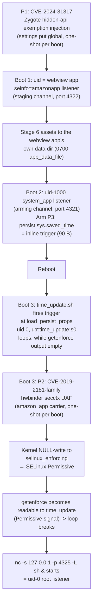

# Stage 1: Root Method (SnuSnuRoot chain, trona port)

## Executive summary

The chosen root route is the **SnuSnuRoot userland chain** (by voidnullvalue,
verified upstream on PS7331.4460N), ported to trona (reference build
PS7319/1735) and **live-verified end-to-end three times** (runs 16–18; see
[../stage1-root/README.md](../stage1-root/README.md)). It requires **no
boot-partition writes**; the SELinux flip is in-memory and the chain can be
re-armed on demand. The only probabilistic step (the binder leak) fails safe, 
a miss returns `ENODATA`, and it is **recoverable by retrying** (see below).
All kernel-side prerequisites have been verified present in the PS7319
kernel source and binary, and the chain spans PS7319 → PS7331 via
per-version carrier variants (unknown firmware fails closed).

**Root also survives reboot unattended**: [../stage4-persistent/](../stage4-persistent/)
installs an on-device boot actor that restores the chain with no host attached
(measured: 10/10 consecutive reboots). Everything it adds lives under `/data`.

## The chain (four primitives)



### P1: CVE-2024-31317 (Zygote injection)

`settings put global hidden_api_blacklist_exemptions "<payload>"` is parsed by
system_server and forwarded to zygote. A crafted payload embeds a complete
`--runtime-args ... --setuid=<uid> --seinfo=<seinfo> --invoke-with <cmd>`
spawn command, making zygote fork a child running our command with a chosen
uid and SELinux seinfo.

Constraints (verified upstream and live on this port):
- **One-shot per boot**: only the first exception-set after boot reaches the
  wrapper-exec path. Staging and arming are two *different* injections and
  cannot share a boot.
- **uid 0 is rejected** by zygote. The port uses two channels: the webview
  app's own uid (runtime-resolved via `pm list packages -U`; 10161 on the
  reference device) with `seinfo=amazonapp:targetSdkVersion=22:complete` for
  staging, and uid 1000 with `seinfo=platform:targetSdkVersion=28:complete`
  for arming.
- The value must be deleted immediately after (`settings delete`); a stale
  value is a soft-bootloop guard violation.

### P2: CVE-2019-2181-family (hwbinder secctx UAF → kernel NULL-write)

The kernel's `binder_transaction()` appends the sender's SELinux security
context to `extra_buffers_size` when the target node has `txn_security_ctx`.
The SnuSnuRoot exploit grooms this into a use-after-free on a binder node,
retains it via epoll, and obtains:

1. **Arbitrary kernel read** (`retained_read64` via doctored epoll items)
2. **A single NULL-write** via `hlist_del(&node->dead_node)`; the freed node's
   `pprev` is controlled to point at `selinux_enforcing`, and the deletion
   writes NULL there → **SELinux Permissive**.

Verified in the PS7319 kernel source (`drivers/android/binder.c`):
- `binder_transaction` secctx handling at lines 3131–3142
  (`extra_buffers_size += ALIGN(secctx_sz, sizeof(u64))`), present, unpatched.
- `binder_dec_node_nilocked` (line 1456) → `hlist_del(&node->dead_node)` at
  line 1504(the NULL-write primitive site) present.
- `binder_node.txn_security_ctx` bitfield (line 401), present.

The write is **in-memory only**: reverts on reboot. This is by design.

**The leak is probabilistic (live finding, runs 16–18).** The
`HWBINDER_STATEFUL` leak is a kernel race: observed ~57% hit rate per fresh
boot before remediation. A miss returns `ENODATA` (`result=0x5000003d...`) and
spends that boot's binder-node state; it is a normal miss, not a device
failure. Root cause (RCU-delayed epitem free outrunning the ~0.4 s race
window) and the 10 ms wait rescale are documented in
[ENODATA-ANALYSIS.md](ENODATA-ANALYSIS.md).

**A miss is retryable, and this corrects the earlier assumption.** This file
previously repeated the claim that a miss was terminal until reboot. Measured
on 2026-10-07: on a boot whose first attempt had already returned `ENODATA`,
re-running the carrier succeeded on the **next attempt in the same boot** and
left SELinux Permissive. `ENODATA-ANALYSIS.md` §12 has the probe and the raw
output. The JNI carrier used by the host-driven flow cannot exploit this (it
holds the probe port, so a second attempt cannot be injected) and still reboots
on a miss; the statically linked carrier used by the stage-4 boot actor can, and
does; it retries up to 5 times in-boot, which is what makes the persistent
chain reliable rather than a per-boot coin flip.

The rescale applies to **both** carriers and needed a different tool for each:
[patch-wait.py](../stage1-root/patch-wait.py) rewrites the shared `.rodata`
literal in `libhwbinder_target.so`, while
[patch-wait-inline.py](../stage1-root/patch-wait-inline.py) rescales the
instructions in the statically linked `snusnu_hwbinder_root`, which builds the
same timespec inline and has no literal to patch.

### P3: `time_update` property waiter (uid-0 handoff)

Amazon's `/system/bin/time_update.sh` (init service `time_update`, user root,
context `u:r:time_update:s0`) reads `persist.sys.saved_time` at boot and
passes it to `time -s <value>`. The value is parseable as shell, command
injection.

**Port redesign (the upstream file-based bootstrap does not work here).**
Upstream's trigger runs a payload *file* from
`/data/securedStorageLocation/w/b`; the live binary policy (hash-verified
against the shipped CILs) grants `time_update` **no read on any
staging-writable location** (assetstorage_data_file, cache_file, …), so the
file bootstrap was disproven offline. The port's trigger carries the whole
payload **inline**: no file read is needed while enforcing:

```
x[$(until [ "$(getenforce)" ];do sleep 1;done;toybox nc -s 127.0.0.1 -p 4325 -L sh&)]000
```

Mechanism (verified from the OTA image of `time_update.sh`): the script
strips the trailing `000`, compares against system time, and the arithmetic
re-expansion executes the `$(...)`. `getenforce` is **denied** to
`time_update` while enforcing (avc denial → empty output) and becomes
readable the moment the carrier's NULL-write flips Permissive, so the
loop's break condition *is* the Permissive signal. `nc` then binds
`127.0.0.1:4325` with a shell per connection (TCP sockets are likewise
denied while enforcing, allowed once Permissive); the trailing `&`
backgrounds nc so the substitution completes and `time_update.sh` exits
cleanly. The trigger is 90 bytes, within `PROP_VALUE_MAX` (91) for API 28.

Verified on this device (PS7319/1735):
- `/system/etc/init/timeupdate.rc` exists, service `user root`, `disabled`,
  `oneshot`, started on `load_persist_props_action`.
- `persist.sys.saved_time` is currently a clean numeric value
  (`1791219606604`); the arming precondition.
- `hidden_api_blacklist_exemptions` is `null`, P1 precondition clean.
- Live (runs 16–18): trigger fired at boot, waiter looped on `getenforce`,
  listener came up the moment Permissive landed.

**Restore caveat (live finding):** restoring `persist.sys.saved_time` to
its numeric snapshot *in-boot* proved impossible, `time_update` lacks the
property-socket write and `run-as` requires a debuggable package. The
exit-state guard therefore accepts either outcome: numeric (restored /
disarmed) or still-armed (the waiter re-fires every boot; the desired
persistent-root state). The property can always be restored via the
uid-1000 channel on the next boot (the `disarm` path).

### P4: persistence (optional, per-boot re-arm)

Two mechanisms exist, and **both are now in place**:

- **The armed property (stage 1, live-proven):** while
  `persist.sys.saved_time` holds the inline trigger, the waiter re-fires on
  every boot and re-installs the uid-0 listener within ~30 s of
  `load_persist_props_action`, no app, no extra injection. But on this firmware
  the property is **not durable on its own**: Amazon's `TimeService` NTP-syncs
  ~20 s and ~130 s into boot and overwrites it with the synced clock, so the
  *next* boot has no trigger. Stage 1 relies on a host to re-arm; on its own it
  gives root only on the boot that was armed.
- **The boot actor (stage 4, ported and live-proven):** the direct-boot APK
  `io.github.voidnullvalue.snusnuroot.persistence` spends P1 each boot to
  re-create the uid-1000 channel, keeps the trigger armed via a detached
  re-arm watchdog, and re-runs P2 on the statically linked carrier, retrying
  in-boot if the first attempt misses. This is what makes the chain
  self-healing across reboots with no host. Everything lives on `/data`;
  nothing touches boot/system/vendor. Measured: **10/10 consecutive
  reboots**; see [../stage4-persistent/README.md](../stage4-persistent/README.md)
  and upstream's [persistence-v2.md](../refs/SnuSnuRoot/notes/persistence-v2.md).

A live-Magisk userspace bootstrap (Magisk runtime on `/sbin` tmpfs, no boot
writes) is ported ([../stage1-root/port/scripts/](../stage1-root/port/scripts/))
but has **not been live-verified** on this device, and the stage-4 waiter
reports `magisk=skipped` because `magisk_restore.sh` is not installed by it.

## Why this route (vs. the Mali kernel exploit)

| | SnuSnuRoot (chosen) | Mali CVE-2022-38181 (Eric Pardee) |
|---|---|---|
| Kernel panic risk | none (userland + one NULL-write); the leak race fails safe (`ENODATA` → retry) | ~50% per attempt (slab race), each = reboot |
| Boot partition writes | none | none |
| SELinux | Permissive (in-memory) | Permissive (in-memory) |
| Root persistence | **host-free across reboots (stage 4, live-proven 10/10)**: boot actor + re-arm watchdog + in-boot carrier retry | per-boot re-run (grind script) |
| Verified on | PS7331 (upstream); **PS7319 live end-to-end (runs 16–18)**; PS7321/PS7326 carriers built, untested live | PS7326 only; offsets are build-specific |
| Address dependency | **per-version carrier variants** (offline OTA extraction, runtime selection by build token) | static offsets per build (the +0x5c000 trap) |

## The trona porting work

1. **`selinux_enforcing` address**: the upstream binary hardcodes
   `0xffffff8009971668` (PS7331). For PS7319/1726 the OTA-derived value is
   `0xffffff8009965628` (see [../tools/kernel-symbols.md](../tools/kernel-symbols.md)).
   **Design decision: per-version carrier variants.** Runtime kallsyms
   resolution was investigated and **disproved** (`kptr_restrict=2` zeroes
   addresses even for uid 0, verified live during P3). Instead, the
   address is extracted offline from each firmware version's OTA kernel
   ([../tools/extract-symbols.py](../tools/extract-symbols.py),
   `enforcing_setup` anchor, 3/3 ground-truth matches), embedded in a
   per-version carrier binary, and selected at runtime by the device's
   `ro.build.id` PS token from [../stage1-root/carriers/carriers.tsv](../stage1-root/carriers/carriers.tsv).
   Unknown firmware fails closed (no write happens). The 1726→1735 build
   delta was resolved by dumping the running boot partition via live root
   and confirming the compiled-in value matches the OTA-derived one.
2. **`sender_context_allocation`**: upstream computes this from the live
   process context (24 bytes for `u:r:amazon_app:s0`); build-independent.
3. **Binder struct layout**: `binder_node` embeds the
   `rb_node`/`dead_node` union (binder.c:372–375) and the
   `txn_security_ctx` bitfield, matching upstream's expectations; the
   exploit never hardcodes a `binder_node` offset (it drives the kernel's
   own `hlist_del` through the UAF'd node via `flat_binder_object`), so
   the layout only needs to match upstream's proven PS7331 kernel, same
   4.4 binder.c lineage. Verified identical in the PS7319 kernel source.
4. **Zygote payloads**: two channels, both verified live: uid 1000 with
   `--seinfo=platform:targetSdkVersion=28:complete` for arming (API 28,
   `ro.product.first_api_level=28`), and the webview app's uid with
   `--seinfo=amazonapp:targetSdkVersion=22:complete` for staging and the
   P2 carrier (the upstream-proven carrier domain).
5. **WebView zygote ABI handling**: upstream ships both arm64-v8a and
   armeabi-v7a JNI payloads with ELF-class verification; device is
   `arm64-v8a,armeabi-v7a,armeabi`. Compatible. The 32-bit carrier is
   staged but never selected (the primitive's kernel pointers are 64-bit).
6. **Staging location**: upstream stages to the world-traversable
   `/data/securedStorageLocation/` via a uid-1000 channel; on PS7319 no
   staging channel can write there (SELinux neverallow appdomain
   system_data_file write). The port stages into the webview app's *own*
   data dir (`/data/user/0/com.amazon.webview.chromium/files/sn`, 0700
   app_data_file) via a listener running as that app's uid, same uid +
   same domain = full read/write to its own dir. The carrier reads the
   assets from there.
7. **ENODATA remediation**: the leak's wait rescale (1 ms → 10 ms) plus the
   in-boot retry. Applied to **both** carriers by different means: the shared
   `.rodata` literal in `libhwbinder_target.so` (file offset 0x11c8) via
   [../stage1-root/patch-wait.py](../stage1-root/patch-wait.py), and the 9
   inline timespec sites in the statically linked `snusnu_hwbinder_root` via
   [../stage1-root/patch-wait-inline.py](../stage1-root/patch-wait-inline.py).
   The host-driven flow also raised leak/write `nc -w` to 20 s. See
   [ENODATA-ANALYSIS.md](ENODATA-ANALYSIS.md), including §11 (the inline
   carrier) and §12 (the retry finding).

## Safety invariants (from upstream, enforced by tooling)

1. `hidden_api_blacklist_exemptions` must return to `null`, checked before
   and after every P1 use.
2. P1 and P2 are one-shot per boot, never re-run staging while armed.
3. `EALREADY (0x40...)` on the P2 leak = boot spent; reboot (physically if
   `adb reboot` is ignored). `ENODATA` on the leak = probabilistic miss, and
   **it is retryable**: in the same boot for the statically linked carrier,
   on a fresh boot for the JNI carrier (which holds the probe port). The
   host-driven orchestrator retries across fresh boots automatically; the
   stage-4 boot actor retries in-boot, up to 5 times.
4. `persist.sys.saved_time` must end the run either restored to its numeric
   snapshot or still armed (the enforced exit-state guard; in-boot restore
   is impossible, see P3). A `disarm` always restores the numeric snapshot
   via the uid-1000 channel.
5. The P2 carrier process must stay resident for the whole boot (exiting it
   triggers an MTK `watchdog_sw` reset, upstream fixed this).
6. `disarm` removes everything and returns the device to stock.

## Status

- [x] Kernel prerequisites verified in PS7319 source (binder secctx, hlist_del,
      jit-free, n/a for this route)
- [x] Device-side preconditions verified (saved_time numeric, exemptions null,
      timeupdate.rc present)
- [x] `selinux_enforcing` extracted from OTA kernel + cross-build validated
- [x] Per-version carrier variants (PS7319 / PS7321+PS7326 / PS7331) with
      runtime selection by build token; unknown firmware fails closed
- [x] Ported scripts + rebuilt carrier tested on device (runs 16–18, 
      see stage1-root/README.md)
- [x] ENODATA root-caused, rescale applied to **both** carriers (run-18
      attempt-1 hit for the JNI carrier; [ENODATA-ANALYSIS.md](ENODATA-ANALYSIS.md))
- [x] **P5: persistence APK ported and live-proven**, 
      [../stage4-persistent/](../stage4-persistent/); 10/10 consecutive
      reboots, no host attached
- [x] In-boot carrier retry established as the reliability mechanism
      ([ENODATA-ANALYSIS.md §12](ENODATA-ANALYSIS.md))
- [ ] Live-Magisk userspace bootstrap, ported, not live-verified
      (stage 4 reports `magisk=skipped`)
- [ ] PS7321 / PS7326 / PS7331 full flows, carriers built + prerequisites
      verified offline, untested live
