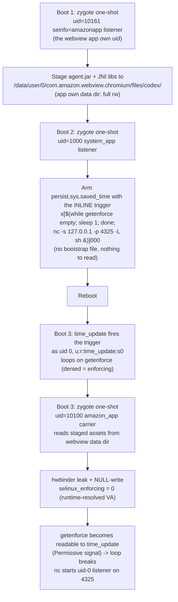

# PS7319 Port: Adaptation Design

The upstream SnuSnuRoot chain was verified on PS7331.4460N. Porting to
PS7319/1735 required resolving real firmware differences, all discovered
through read-only probing + offline policy analysis (no risky live tests).

## Confirmed differences (PS7331 → PS7319)

| Aspect | PS7331 (upstream) | PS7319 (this device) | Impact |
|---|---|---|---|
| `selinux_enforcing` VA | `0xffffff8009971668` | `0xffffff8009965628` (1726 OTA; runtime-resolved at use) | carriers patched ([patch-address.py](patch-address.py)) |
| Asset staging path | `/data/securedStorageLocation/` writable by the uid-1000 `system_app` channel | **not writable** by `system_app` (SELinux: appdomain neverallow-write on `system_data_file`) | staging must use a different uid/path |
| Waiter bootstrap path | `/data/securedStorageLocation/w/b` | same blocker | bootstrap relocated to `/cache` |
| `amazon_app` domain | present | **present and running** (17 processes) | carrier OK |
| `amazonapp` seinfo | in mac_permissions | not in the 1726 OTA files, but the live 1735 policy runs `amazon_app` apps → mapping exists at runtime | carrier OK (verify empirically) |
| `persist.sys.*` setprop | `system_app` allowed | `system_app` allowed (`allow system_app system_prop (property_service (set)))`) | arming OK |

## SELinux facts driving the design (live binary policy, parsed with tools/policydb-parse.py)

Key correction from the full binary-policy parse (2026-10-05): the shipped
CILs are *inputs*; the **live** policy is the precompiled binary (hash
`f4985b58...` matches `plat_and_mapping_sepolicy.cil.sha256`, so it is what
the kernel loaded). The binary differs from the CILs in critical ways:

- `amazon_app` is **not** in `appdomain` in the binary (the CIL says it is).
  Its own-data-dir access comes from a direct `allow amazon_app app_data_file`
  rule, not from appdomain membership.
- `time_update`'s complete readable set: `shell_exec`, `toolbox_exec`,
  `time_update_exec`, `time_update_tmpfs`, `sysfs_devinfo`, own-domain files.
  **No read on `cache_file`, `assetstorage_data_file`, `system_data_file`,
  or `shell_data_file`.** This killed both the upstream bootstrap path and
  the /cache redesign; the inline trigger needs no file reads.
- `time_update` has **no `tcp_socket` permissions**: the root listener can
  only bind *after* Permissive (denials become allowed), which the inline
  trigger's getenforce loop guarantees.
- `system_app` **cannot** write `assetstorage_data_file` (dir or file), 
  confirmed empirically (Permission denied) and by the binary parse.
  The domains that can: `platform_app`, `priv_app`, `mediaserver`, `init`.
- `system_app` **can** write `cache_file` (empirically verified), but that
  no longer matters for the waiter (nothing to read there).
- `amazon_app` has full rw on `app_data_file`; the carrier reads its
  staged assets from the webview app's own data dir (same uid + domain).
- Only `system_app`/`system_server` can `setprop persist.sys.*`, the
  uid-1000 arming channel works (upstream-proven, same on this build).

## Adapted flow (three one-shot boots)



### Why the webview app's own data dir

The carrier host is `com.amazon.webview.chromium` (uid 10161, `amazon_app`
domain); the same app upstream uses (its class
`com.android.webview.chromium.WebViewChromiumFactoryProviderForP` is the
agent's main class). Spawning the staging listener as the **same uid with the
same seinfo** gives it full read/write to its own `app_data_file`-labeled
data dir, and the carrier (same uid/domain) inherits read access. No
cross-domain SELinux grants needed.

### Why /cache for the waiter bootstrap: SUPERSEDED

> **2026-10-05: this design was WRONG and has been replaced by the inline
> trigger below.** A full parse of the live binary policy
> (`tools/policydb-parse.py`, implementing the device's own kernel policydb
> reader from `refs/kernel-7.3.1.9`) proved `time_update` has **no read**
> on `cache_file`, its entire readable set is `shell_exec`, `toolbox_exec`,
> `time_update_exec`, `time_update_tmpfs`, `sysfs_devinfo`, and own-domain
> files. No staging-writable location is readable by the waiter. The
> upstream `/data/securedStorageLocation/w/b` bootstrap fails on this
> policy for the same reason (no read on `assetstorage_data_file`).

### The inline trigger (current design)

The whole waiter payload rides inside `persist.sys.saved_time` itself, so
nothing needs to be read from disk while enforcing:

```
x[$(while :;do [ "$(getenforce)" ]&&break;sleep 1;done;nc -s 127.0.0.1 -p 4325 -L sh&)]000
```

- `time_update.sh` (extracted from the OTA image) does
  `store_time=${store_time%???}` then `if (("$store_time" > ...))`, the
  shell arithmetic re-expands `$(...)`, executing the payload as
  **uid 0, u:r:time_update:s0**.
- `getenforce` is *denied* to `time_update` while enforcing (avc denial →
  empty output) and becomes readable the instant the carrier's NULL-write
  flips Permissive; the loop's break condition **is** the Permissive signal.
- `nc -s 127.0.0.1 -p 4325 -L sh` binds the root listener. TCP sockets are
  denied to `time_update` while enforcing but allowed once Permissive.
- The trailing `&` backgrounds nc so the command substitution completes and
  `time_update.sh` exits cleanly.
- 90 bytes, fits `PROP_VALUE_MAX` (91) on API 28.
- Failure mode: if the carrier never flips Permissive, the loop spins in a
  `sleep 1` loop inside a oneshot service, harmless; the property can be
  restored to its numeric snapshot via the uid-1000 channel (disarm).

### Runtime address resolution: SUPERSEDED by per-version carriers

Earlier design prose described resolving `selinux_enforcing` at runtime via
a uid-0 `/proc/kallsyms` read. **That mechanism was never implemented and
does not work on this device**: `kptr_restrict=2` zeroes symbol addresses
in `/proc/kallsyms` even for uid 0 (verified live during P3), so the
runtime read cannot produce the address.

The actual mechanism is **per-version carrier variants**: the address is
derived offline from each firmware version's OTA kernel via the validated
extraction pipeline ([tools/extract-symbols.py](../../tools/extract-symbols.py),
`enforcing_setup` anchor, 3/3 ground-truth matches, see
[tools/kernel-symbols.md](../../tools/kernel-symbols.md)), embedded in a
carrier binary per version, and selected at runtime by the device's
`ro.build.id` PS token from [carriers.tsv](../carriers/carriers.tsv).
Unknown firmware fails closed (no write happens). See
[make-carrier.py](../make-carrier.py) to add a version.

The compiled-in value remains a pre-flight sanity check: the write stage
verifies `getenforce=Permissive` immediately after the NULL write, so a
wrong address is detected (write ineffective) rather than silently
accepted, but it would still have written 8 bytes to an unverified kernel
address, which is exactly why the version gate fails closed instead.

### Carrier wait-literal patch (2026-10-05, live-validated; extended 2026-10-07)

The arm64 JNI carrier's every `wait_one_millisecond()` call site consumes
one shared 16-byte timespec literal at file offset 0x11c0. tv_nsec
(offset 0x11c8) was rescaled 1 ms → 10 ms to widen the stage-0x50 RCU race
window (~0.4 s → ~4 s), fixing the ENODATA miss mode (~43% of fresh boots
pre-patch). Full analysis:
[docs/ENODATA-ANALYSIS.md](../../docs/ENODATA-ANALYSIS.md); patch tool:
[patch-wait.py](../patch-wait.py).

**The standalone carrier needed the same rescale by a different mechanism**
(2026-10-07). `snusnu_hwbinder_root`(which the stage-4 boot actor executes)
is statically linked and builds the same timespec **inline** as two instruction
immediates, with no `.rodata` literal to rewrite. `patch-wait.py` cannot touch
it; [patch-wait-inline.py](../patch-wait-inline.py) rescales its 9 sites
(36 bytes), paired by register and verified by disassembly. §11 of
[docs/ENODATA-ANALYSIS.md](../../docs/ENODATA-ANALYSIS.md) has the details.

**And the miss it was fixing turned out to be recoverable in-boot** (§12): a
retry after a failed attempt succeeded on the same boot, so the stage-4 actor
retries rather than rebooting. That, not the rescale, is what makes the
persistent chain reliable.

- Host prebuilt sha256: `e298c1f7…` → `8b71c71da7b8b77f…`
  (full: `8b71c71da7b8b77fcaa854b013b5f87054e3881e60918ced3c18af4b20586696`).
- Companion: leak/write `nc -w` raised 6 → 20 in
  [reroot_after_boot.sh](scripts/reroot_after_boot.sh) (patched carrier
  answers in ~4–5 s).
- Validated live in run-18: attempt 1/6 HIT, full chain green
  (`diagnostics/root-run-18.log`).
- The 32-bit carrier is not patched (never selected on this device).

## Safety properties preserved

1. `hidden_api_blacklist_exemptions` returns to `null` after every injection
   (checked before/after; stale value = soft bootloop guard).
2. One-shot primitives are never double-spent; each boot does exactly one
   injection.
3. `persist.sys.saved_time` is snapshot-restored to its original numeric
   value by the waiter.
4. No boot/system/vendor/preloader/lk writes anywhere in the chain.
5. Every failure mode leaves the device booting normally; `disarm` restores
   stock state.

## Open empirical items (next-boot tests)

- [x] ~~Confirm the zygote payload spawns uid 10161 with `u:r:amazon_app:s0`
      context on 1735~~, **CONFIRMED live** (staging listener reported
      `uid=10161 ... context=u:r:amazon_app:s0`; all six assets landed with
      matching SHA-256).
- [x] ~~Confirm `time_update` can read `/cache/snusnu/b`~~, **DISPROVED
      offline**: the binary policy grants no such read; design replaced by
      the inline trigger (no file reads at all).
- [x] ~~Confirm the inline trigger survives `setprop` (90 bytes vs
      `PROP_VALUE_MAX`=91) and that `time_update.sh`'s arithmetic executes
      the `$(...)` on this build~~, **CONFIRMED live** (run-17/run-18:
      trigger fired, waiter armed, root listener live).
- [x] ~~Confirm the waiter's `/proc/kallsyms` read resolves
      `selinux_enforcing`~~, **DISPROVED live**: `kptr_restrict=2`
      zeroes addresses even for uid 0. Replaced by per-version carrier
      variants (see "Runtime address resolution, SUPERSEDED").
